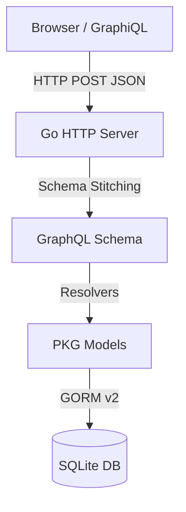

# Go / GraphQL Portfolio API

A world-class implementation of **Go**, **GraphQL**, and **SQLite**. This API serves as a personal portfolio backend, demonstrating clean architecture, type safety, and modern infrastructure.

## Architecture



## Features

- **GraphQL Server**: Custom HTTP handler implementing the GraphQL specification.
- **Modern Infrastructure**: Uses **GORM v2** for robust ORM and **Go 1.21**.
- **Portfolio Data**: Schema for Projects, Skills, and Experience.
- **GraphiQL Interface**: Interactive playground served at the root URL.
- **Dockerized**: Fully containerized with multi-stage builds.

## Getting Started

### Prerequisites

- [Go](https://golang.org/dl/) (version 1.21 or higher)
- [Docker](https://www.docker.com/) (recommended)

### Running with Docker

```bash
docker-compose up --build
```
The server will be available at `http://localhost:8080`.

### Running Manually

1. Install dependencies: `go mod tidy`
2. Run the server: `go run main.go`

## Usage

Navigate to `http://localhost:8080` to access the GraphiQL playground.

### Example Queries

#### Get Portfolio Data

```graphql
query {
  projects {
    title
    techStack
  }
  skills {
    name
    category
    level
  }
  experiences {
    company
    role
    period
  }
}
```

#### Create a New Project

```graphql
mutation {
  createProject(
    title: "GraphQL Portfolio",
    description: "A Go backend for portfolio management",
    techStack: "Go, GraphQL, SQLite"
  ) {
    id
    title
  }
}
```

## Project Structure

```
├── main.go             # Server entry point & Schema stitching
├── graphiql.html       # Client-side GraphiQL UI
├── pkg
│   └── model          
│       ├── db.go       # Central GORM v2 setup
│       ├── project.go  # Project model & resolvers
│       ├── skill.go    # Skill model & resolvers
│       └── experience.go # Experience model & resolvers
├── portfolio.db        # SQLite database file
├── Dockerfile          # Multi-stage Docker build
└── docker-compose.yml  # Docker orchestration
```
