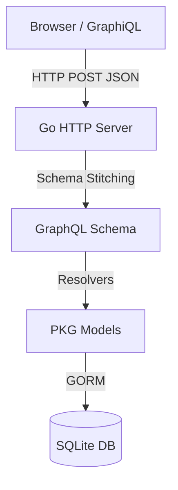

# Go / GraphQL HTTP Server

Clean integration of **Go**, **GraphQL**, and **SQLite**. An example of how to build a robust, type-safe GraphQL API server without the overhead of heavy frameworks.

## Architecture


## Features

- **GraphQL Server**: Custom HTTP handler implementing the GraphQL specification.
- **SQLite Database**: Lightweight, serverless, and self-contained SQL database engine.
- **GORM ORM**: Developer-friendly ORM for Golang.
- **GraphiQL Interface**: In-browser IDE for exploring GraphQL.
- 
The project follows a modular structure:

- **`main.go`**: Entry point. Sets up the HTTP server, initializes the database connection, and defines the root GraphQL schema.
- **`pkg/model`**: Contains the data models, database schema definitions (GORM structs), and GraphQL type definitions + resolvers.
- **`graphiql.html`**: A lightweight client to test the API directly in your browser.

## Getting Started

### Prerequisites

- [Go](https://golang.org/dl/) (version 1.13 or higher)
- GCC (required for `go-sqlite3`)

### Installation

1. Clone the repository:
   ```bash
   git clone https://github.com/corganfuzz/go-gql-sqlite.git
   cd go-gql-sqlite
   ```

2. Install dependencies:
   ```bash
   go mod download
   ```

### Running the Server

Run the application:

```bash
go run main.go
```

The server will start at `http://localhost:8080`.

## Usage

### Using GraphiQL

Open your browser and navigate to:

> **[http://localhost:8080](http://localhost:8080)**

You will see the GraphiQL interface where you can write and execute queries.

### Example Queries

#### Create a Tutorial

```graphql
mutation {
  create(id: 1, title: "Go & GraphQL Guide") {
    id
    title
  }
}
```

#### List All Tutorials

```graphql
{
  list {
    id
    title
    author {
      Name
    }
  }
}
```

#### Get a Single Tutorial

```graphql
{
  tutorial(id: 1) {
    title
    comments {
      body
    }
  }
}
```
